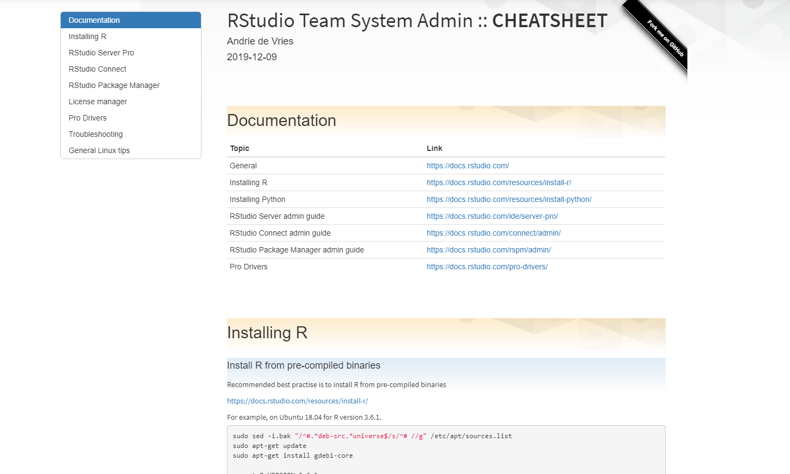

<!-- README.md is generated from README.Rmd. Please edit that file -->

```{r, include = FALSE}
knitr::opts_chunk$set(
  collapse = TRUE,
  comment = "#>"
)
```

# sys-admin-cheatsheet

<!-- badges: start -->
<!-- badges: end -->

Because sometimes you just need a quick reminder of that incantation to get things done.

This is a cheetsheat for RStudio Team system administration.

View the deployed version at https://colorado.rstudio.com/rsc/rstudio-team-sysadmin-cheatsheet/


